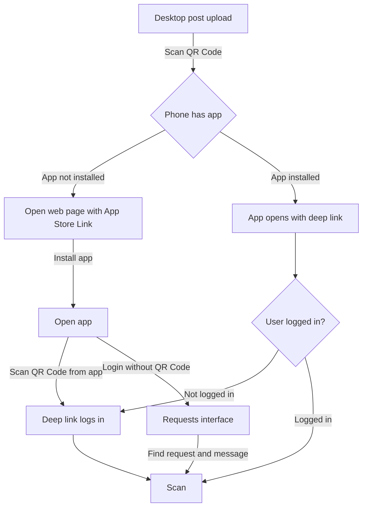

# FragDenStaat Scanner

This is a Tauri 2.0 mobile application using Vue and Ionic Framework.

## Project setup

See [Tauri Prerequesites](https://tauri.app/start/prerequisites/)

## Development

### iOS

For development, set to automatic signing in XCode.

```
pnpm tauri android dev
```

## Distribution

See `.env-exmaple` for the required environment variables.

Set new version in `tauri.conf.json`, `src-tauri/Cargo.toml` and `package.json`.

### iOS

Set XCode project to manual signing, set the correct provisioning profile and associated domains (applinks and webcredentials).

```bash
# possibly: pnpm tauri ios init
bash script/build_ios.sh
```

### Android

```bash
# possiby: pnpm tauri android init
# pnpm tauri icon public/fds-scanner.png --ios-color "#fff"
bash script/build_ios.sh
```

## Documentation

### Login flow with deep link


